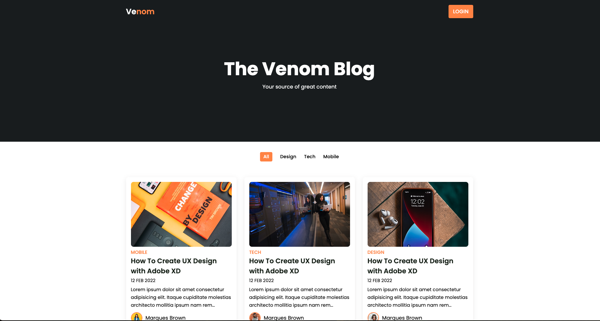

# Responsive Blog Website

## Overview

A modern, responsive blog website built with HTML, CSS, and JavaScript. This project demonstrates contemporary web design principles with a clean card-based layout, dynamic filtering system, and mobile-first responsive design. The website features a professional blog interface with post categorization, author profiles, and optimized content presentation.

## Preview



## Purpose

This project demonstrates proficiency in:
- **Modern Web Design** with contemporary layouts and typography
- **Responsive Grid Systems** using CSS Grid and Flexbox
- **Content Organization** with categorized blog posts and filtering
- **Professional UI/UX** design patterns for content websites
- **CSS Custom Properties** for maintainable theming systems

## Technical Implementation

### Key Features

- **Responsive Grid Layout**: Auto-fit grid system that adapts to different screen sizes
- **Category Filtering**: Interactive filter system for blog post categories (All, Design, Tech, Mobile)
- **Card-Based Design**: Modern card layout for blog posts with consistent spacing
- **Author Profiles**: Individual author information with profile images
- **Typography Hierarchy**: Professional text styling with Google Fonts integration
- **CSS Custom Properties**: Maintainable color scheme using CSS variables
- **Fixed Navigation**: Sticky header with logo branding and login functionality
- **Content Truncation**: Smart text clipping for consistent card heights

### HTML Structure

```html
<!-- Modern semantic structure -->
<section class="post container">
  <div class="post-box">
    
    <h2 class="category">Mobile</h2>
    <a href="post-page.html" class="post-title">
      How To Create UX Design with Adobe XD
    </a>
    <span class="post-date">12 Feb 2022</span>
    <p class="post-description">Lorem ipsum dolor sit amet...</p>
    <div class="profile">
      
      <span class="profil-name">Marques Brown</span>
    </div>
  </div>
</section>
```

### CSS Highlights

```css
/* CSS Custom Properties for theming */
:root {
  --container-color: #1a1e21;
  --second-color: #fd8f44;
  --text-color: #172317;
  --bg-color: #fff;
}

/* Responsive grid system */
.post {
  display: grid;
  grid-template-columns: repeat(auto-fit, minmax(280px, auto));
  justify-content: center;
  gap: 1.5rem;
}

/* Content truncation for consistency */
.post-title {
  display: -webkit-box;
  -webkit-line-clamp: 2;
  -webkit-box-orient: vertical;
  overflow: hidden;
}
```

## Project Structure

```
blog/
├── index.html          # Main HTML structure
├── css/
│   └── style.css       # Complete styling and responsive design
├── js/
│   └── main.js         # JavaScript functionality (expandable)
├── assets/
│   └── images/
│       └── img-1.png   # Website screenshot
└── images/
    ├── post-1.jpg to post-9.jpg    # Blog post images
    └── profile-1.jpg to profile-3.jpg  # Author profile images
```

## Design Patterns

### CSS Architecture
- **CSS Custom Properties** - Centralized color and theme management
- **CSS Grid** - Modern layout system for responsive post grid
- **Flexbox** - Navigation and content alignment
- **Box Model** - Consistent spacing and padding throughout
- **Typography Scale** - Hierarchical text sizing and weights

### Content Management
- **Card-Based Layout** - Consistent post presentation format
- **Category System** - Organized content classification
- **Author Attribution** - Professional blog post crediting
- **Content Truncation** - Uniform card heights with text clipping
- **Image Optimization** - Proper aspect ratios and object-fit

### User Experience Features
1. **Fixed Navigation** - Always accessible header navigation
2. **Visual Hierarchy** - Clear content organization and readability
3. **Interactive Elements** - Hover effects and clickable components
4. **Mobile-First Design** - Optimized for all device sizes

## Browser Compatibility

- Chrome 57+
- Firefox 52+
- Safari 10.1+
- Edge 16+
- IE 11+ (with CSS Grid support)

## Performance Considerations

- **Efficient CSS Grid** - Hardware-accelerated layout rendering
- **Optimized Images** - Proper sizing and compression
- **External Font Loading** - Google Fonts with display=swap
- **Minimal JavaScript** - Lightweight for fast loading
- **CSS Organization** - Well-structured stylesheets for maintainability

## Content Features

| Component | Description | Functionality |
|-----------|-------------|---------------|
| Header | Fixed navigation with branding | Persistent site navigation |
| Hero Section | Blog title and subtitle | Brand introduction |
| Filter Bar | Category filtering options | Content organization |
| Post Grid | Responsive blog post layout | Main content display |
| Post Cards | Individual blog post preview | Content preview and navigation |
| Author Profiles | Writer information and avatars | Content attribution |

## Learning Outcomes

This project demonstrates understanding of:
- Modern CSS layout techniques (Grid and Flexbox)
- Responsive web design principles and mobile-first approach
- Content management and organization systems
- Professional typography and visual hierarchy
- CSS custom properties and maintainable theming
- Contemporary web design patterns and UI/UX principles

## Setup & Usage

1. Clone the repository
2. Open `index.html` in a web browser
3. Navigate through the blog posts and categories
4. Test responsive behavior by resizing the browser
5. Explore the filter functionality (expandable with JavaScript)

## Future Enhancements

- [ ] Implement JavaScript filtering functionality for categories
- [ ] Add blog post detail pages with full content
- [ ] Integrate search functionality across posts
- [ ] Add pagination for large numbers of posts
- [ ] Implement dark/light theme toggle
- [ ] Add social media sharing buttons
- [ ] Include comment system integration
- [ ] Add loading animations and transitions

---

**Tech Stack**: HTML5, CSS3, Google Fonts, Boxicons  
**Layout**: CSS Grid, Flexbox  
**Methodology**: Mobile-First, Responsive Design, Component-Based Architecture
