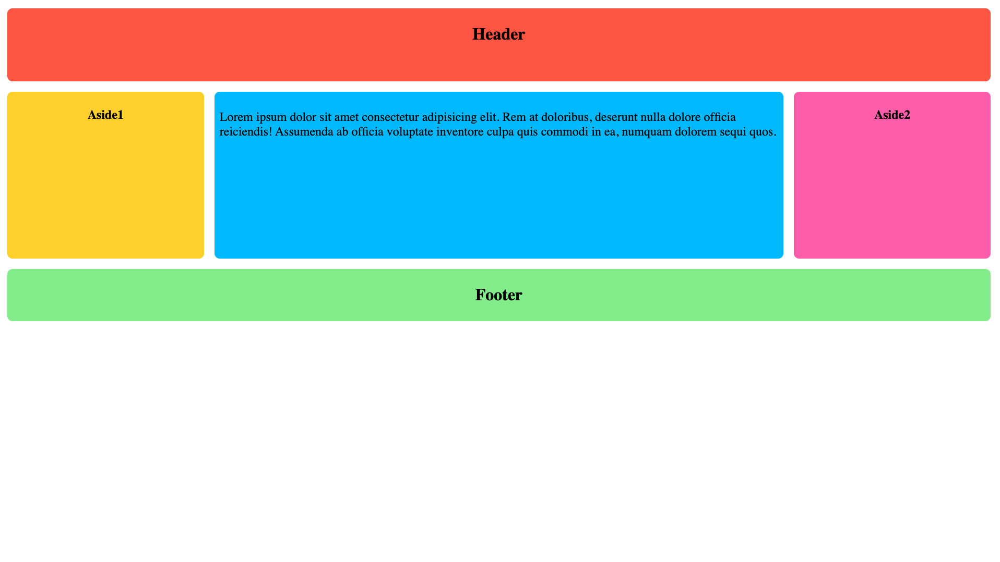

# Responsive Flexbox Layout

## Overview

A responsive web layout demonstration built with CSS Flexbox, showcasing modern layout techniques and mobile-first design principles. This project implements a flexible grid system that adapts seamlessly across different screen sizes without relying on external frameworks.

## Preview



## Purpose

This project demonstrates proficiency in:
- **CSS Flexbox** fundamentals and advanced properties
- **Responsive Design** implementation using media queries
- **Mobile-First** development approach
- **Cross-browser** compatible layout solutions
- **Semantic HTML** structure

## Technical Implementation

### Key Features

- **Flexible Grid System**: Uses `flex-flow: row wrap` for adaptive layout behavior
- **Responsive Breakpoints**: 
  - Mobile: `< 600px` (stacked layout)
  - Tablet: `600px - 799px` (partial flex layout)
  - Desktop: `≥ 800px` (full multi-column layout)
- **Dynamic Content Ordering**: Elements reorder based on screen size using `order` property
- **Proportional Sizing**: Main content area grows 3x relative to sidebar elements

### CSS Architecture

```css
/* Base Layout */
.wrapper {
    display: flex;
    flex-flow: row wrap;
    text-align: center;
}

/* Responsive Flex Items */
.wrapper > * {
    flex: 1 100%;  /* Mobile-first: full width */
}

/* Desktop Layout */
@media all and (min-width: 800px) {
    .main { flex: 3; }  /* 3/5 width ratio */
    .aside { flex: 1; } /* 1/5 width ratio */
}
```

## Project Structure

```
flexbox/
├── index.html          # Semantic HTML structure
├── style.css           # Flexbox CSS implementation
├── assets/
│   └── images/
│       └── screenshot.png
├── css/               # Additional stylesheets (if any)
├── js/                # JavaScript files (if any)
└── img/               # Additional images
```

## Design Patterns

### Flexbox Properties Utilized
- `display: flex` - Establishes flex container
- `flex-flow: row wrap` - Sets direction and wrapping behavior
- `flex: 1 100%` - Shorthand for grow, shrink, and basis
- `order` - Controls visual order without changing HTML structure

### Responsive Strategy
1. **Mobile-First Approach**: Base styles target smallest screens
2. **Progressive Enhancement**: Media queries add complexity for larger screens
3. **Flexible Units**: Uses relative sizing for scalability

## Browser Compatibility

- Chrome 21+
- Firefox 28+
- Safari 9+
- Edge 12+
- IE 11+ (with fallbacks)

## Performance Considerations

- **Zero Dependencies**: Pure CSS implementation
- **Minimal DOM**: Semantic HTML structure
- **Optimized Rendering**: Hardware-accelerated CSS properties
- **Fast Loading**: Lightweight codebase

## Responsive Behavior

| Breakpoint | Layout | Flex Behavior |
|------------|--------|---------------|
| `< 600px` | Stacked | Single column, full width |
| `600px - 799px` | Hybrid | Sidebars start flexing |
| `≥ 800px` | Multi-column | Full grid with custom ordering |

## Learning Outcomes

This project demonstrates understanding of:
- Modern CSS layout techniques
- Responsive web design principles
- Mobile-first development methodology
- Cross-browser compatibility considerations
- Performance optimization strategies

## Setup & Usage

1. Clone the repository
2. Open `index.html` in a web browser
3. Resize the browser window to see responsive behavior
4. Inspect CSS to understand Flexbox implementation

---

**Tech Stack**: HTML5, CSS3, Flexbox  
**Compatibility**: Modern browsers, IE11+  
**Methodology**: Mobile-First, Progressive Enhancement
