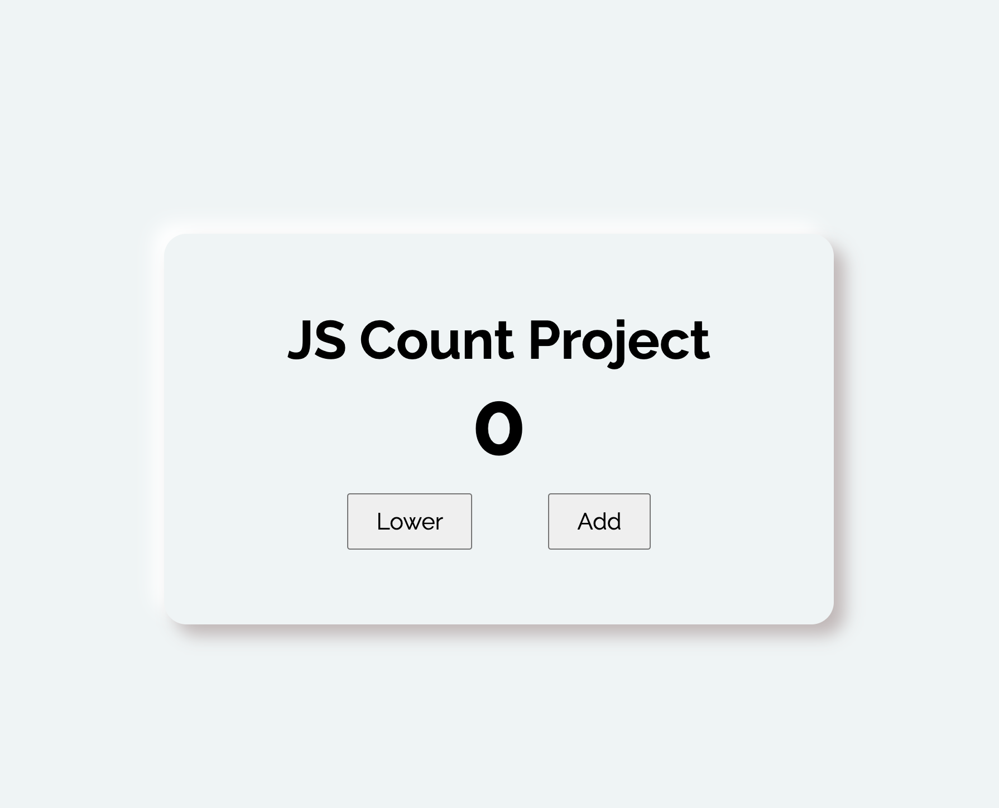
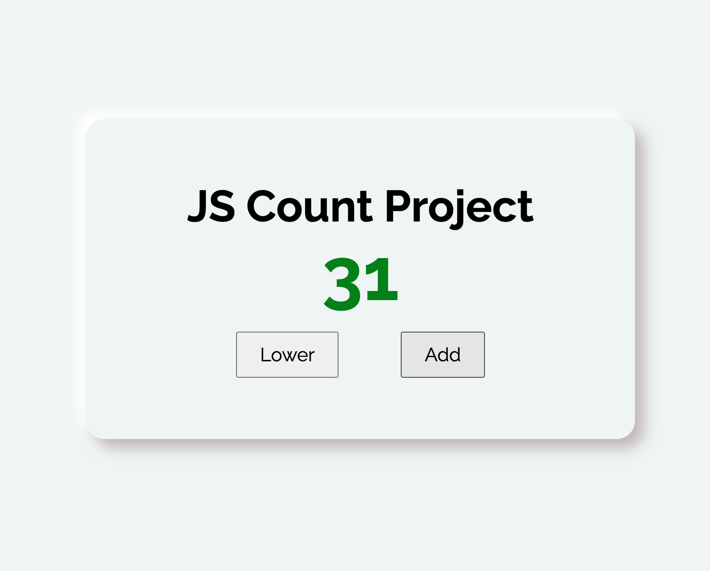
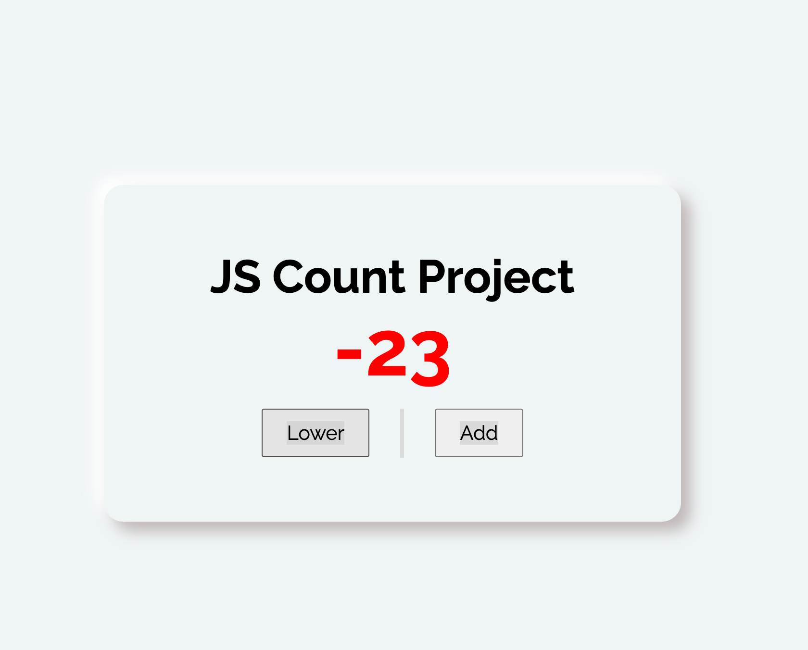

# JavaScript Counter

A simple, interactive counter application built with HTML, CSS, and JavaScript. This project demonstrates dynamic DOM manipulation and responsive UI design for a basic counter tool.

## Features

- **Interactive Counter**: Users can increment or decrement the counter value with buttons.
- **Responsive Design**: Layout adapts to all screen sizes for usability on any device.
- **Modern UI**: Clean card-style interface with smooth styling and Google Fonts.
- **Accessible Markup**: Semantic HTML for improved accessibility.

## Preview

Below are screenshots of the project:

## Usage

1. Clone the repository or copy the `javascript-counter` folder.
2. Open `index.html` in your browser to use the counter.
3. Customize the logic in `app.js` or styles in `main.css` as needed.

## File Structure

- `index.html` – Main HTML file containing the counter UI.
- `main.css` – CSS file for styling the layout and buttons.
- `app.js` – JavaScript file for counter functionality.
- `images/` – Contains screenshots and assets for the project.

## License

This project is open source and available for any use. Attribution is appreciated but not required.

## Technical Overview

This project is a simple interactive counter built with HTML, CSS, and JavaScript. Here’s how it works:

1. **HTML Structure**: The UI consists of a card with a heading, a counter display, and two buttons labeled "Lower" and "Add". The buttons are given specific classes for styling and JavaScript targeting.

2. **CSS Styling**: The layout uses CSS Grid to center the card. The card features a modern look with box-shadow, rounded corners, and responsive fonts. Buttons are styled for clarity and usability.

3. **JavaScript Functionality** (`app.js`):
	 - The script selects the counter display and both buttons.
	 - A counter variable is initialized (starting at 0).
	 - Event listeners are attached to the buttons:
		 - Clicking "Add" increases the counter by 1 and updates the display.
		 - Clicking "Lower" decreases the counter by 1 and updates the display.
	 - The counter value is updated in real-time in the DOM, providing instant feedback to the user.

This project demonstrates basic DOM manipulation, event handling, and dynamic UI updates using vanilla JavaScript.
