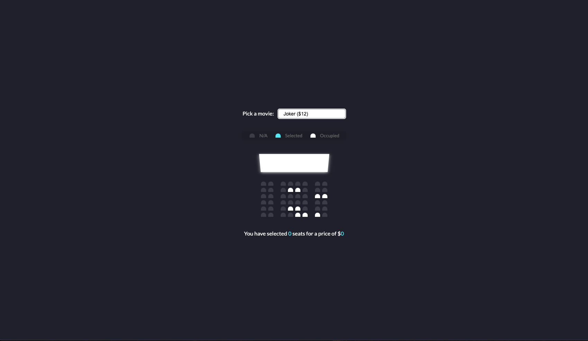
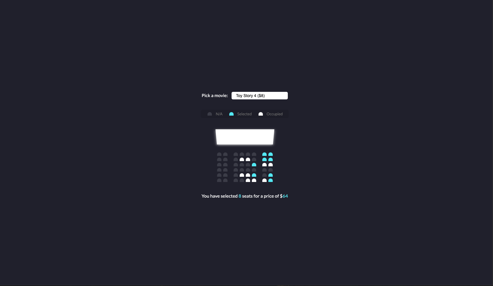

# Movie Seat Booking UI

## Overview

An interactive movie theater seat selection interface built with HTML, CSS, and JavaScript. This project simulates a real-world cinema booking system with dynamic seat selection, movie pricing, and persistent state management using localStorage. The application demonstrates modern UI/UX patterns and responsive design principles.

## Preview

### Initial State


### Selected Seats


## Purpose

This project demonstrates proficiency in:
- **Interactive JavaScript** DOM manipulation and event handling
- **State Management** using localStorage for data persistence
- **Dynamic UI Updates** with real-time calculations and visual feedback
- **CSS Styling** including pseudo-selectors and transforms
- **User Experience Design** with intuitive seat selection patterns

## Technical Implementation

### Key Features

- **Interactive Seat Selection**: Click-to-toggle seat reservation with visual feedback
- **Movie Selection**: Dropdown menu with different movies and pricing
- **Real-time Calculations**: Dynamic price calculation based on selected seats
- **Data Persistence**: localStorage integration to maintain selections across sessions
- **Visual States**: Three distinct seat states (available, selected, occupied)
- **3D Screen Effect**: CSS transform perspective for cinema screen simulation
- **Responsive Layout**: Flexible design that adapts to different screen sizes

### JavaScript Architecture

```javascript
// Core functionality
const container = document.querySelector('.container');
const seats = document.querySelectorAll('.row .seat:not(.occupied)');

// Event-driven seat selection
container.addEventListener('click', (e) => {
  if (e.target.classList.contains('seat') && !e.target.classList.contains('occupied')) {
    e.target.classList.toggle('selected');
    updateSelectedCount();
  }
});

// localStorage persistence
function setMovieData(movieIndex, moviePrice) {
  localStorage.setItem('selectedMovieIndex', movieIndex);
  localStorage.setItem('selectedMoviePrice', moviePrice);
}
```

### CSS Highlights

```css
/* 3D Cinema Screen Effect */
.screen {
  background-color: #fff;
  height: 70px;
  width: 100%;
  transform: rotateX(-45deg);
  box-shadow: 0 3px 10px rgba(255, 255, 255, 0.75);
}

/* Interactive Seat States */
.seat:not(.occupied):hover {
  cursor: pointer;
  transform: scale(1.2);
}

.seat.selected {
  background-color: #6feaf6;
}
```

## Project Structure

```
movie-seat-booking/
├── index.html          # Main HTML structure with seat layout
├── style.css           # CSS styling with seat states and animations
├── script.js           # JavaScript for interactivity and state management
└── assets/
    └── images/
        ├── img-1.png           # Initial application state
        └── img-2-selected.png  # Seats selected state
```

## Design Patterns

### JavaScript Patterns Used
- **Event Delegation** - Single container listener for all seat clicks
- **Array Methods** - map(), indexOf(), forEach() for data manipulation
- **Template Literals** - Dynamic content updates
- **localStorage API** - Client-side data persistence
- **DOM Query Selectors** - Efficient element targeting

### CSS Techniques
- **Flexbox Layout** - Responsive seat arrangement
- **CSS Transform** - 3D perspective effects and hover animations
- **Custom Properties** - Consistent color scheme
- **Pseudo-selectors** - Advanced seat positioning (nth-of-type)

### State Management Strategy
1. **Initial Load** - Populate UI from localStorage
2. **User Interaction** - Update DOM and localStorage simultaneously  
3. **Real-time Updates** - Calculate totals and counts dynamically

## Browser Compatibility

- Chrome 51+
- Firefox 54+
- Safari 10+
- Edge 79+
- IE 11+ (with localStorage support)

## Performance Considerations

- **Efficient Event Handling** - Single event listener with delegation
- **Minimal DOM Queries** - Cached element references
- **Lightweight Storage** - JSON serialization for seat indices
- **CSS Hardware Acceleration** - Transform properties for smooth animations
- **No External Dependencies** - Pure vanilla JavaScript implementation

## User Experience Features

| Feature | Implementation | Benefit |
|---------|---------------|---------|
| Visual Feedback | Hover effects and color changes | Immediate user confirmation |
| Seat States | Three distinct visual states | Clear availability indication |
| Persistent Selection | localStorage integration | Maintains user choices |
| Real-time Pricing | Dynamic calculation display | Transparent cost information |
| Cinema Simulation | 3D screen and theater layout | Realistic booking experience |

## Learning Outcomes

This project demonstrates understanding of:
- Modern JavaScript ES6+ features and DOM manipulation
- Event-driven programming and user interaction patterns
- Client-side data persistence and state management
- CSS animation and transform properties
- UX/UI design principles for e-commerce applications
- Performance optimization techniques

## Setup & Usage

1. Clone the repository
2. Open `index.html` in a web browser
3. Select a movie from the dropdown menu
4. Click on available seats to select/deselect them
5. View real-time price calculation at the bottom
6. Refresh the page to see persistent selections

---

**Tech Stack**: HTML5, CSS3, Vanilla JavaScript  
**APIs**: localStorage Web API  
**Methodology**: Event-Driven Programming, Progressive Enhancement
