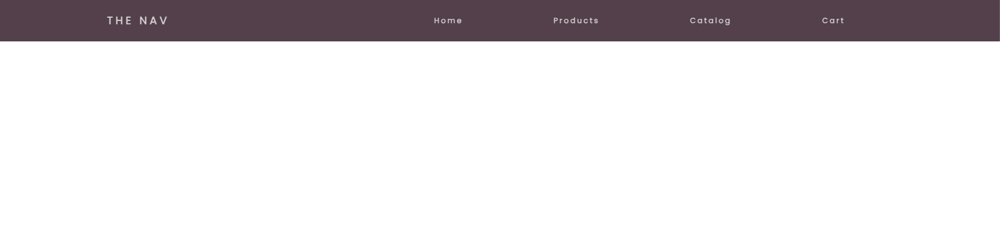
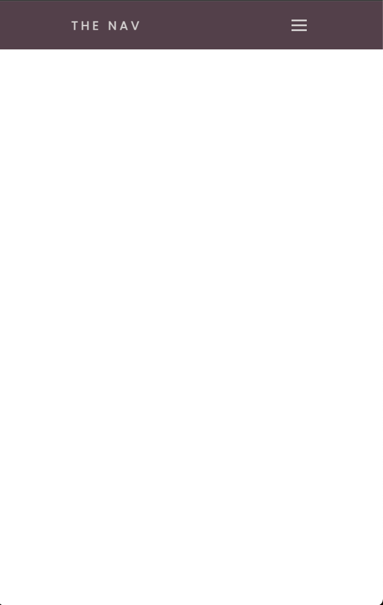

# Responsive Navigation Bar

## Overview

A modern, responsive navigation bar built with HTML, CSS, and JavaScript. This project demonstrates mobile-first design principles with an animated hamburger menu for mobile devices and smooth transitions. The navigation features a clean, professional design that adapts seamlessly from desktop to mobile with interactive animations and accessibility considerations.

## Preview

### Desktop Navigation


### Mobile Navigation  


## Purpose

This project demonstrates proficiency in:
- **Responsive Navigation Design** with mobile-first approach
- **CSS Animations** including keyframes and transitions
- **JavaScript DOM Manipulation** for interactive functionality
- **Flexbox Layout** for modern alignment and spacing
- **Mobile UX Patterns** with hamburger menu implementation

## Technical Implementation

### Key Features

- **Responsive Design**: Adapts from desktop horizontal layout to mobile slide-out menu
- **Hamburger Menu**: Interactive three-line burger icon for mobile navigation
- **Smooth Animations**: CSS transitions and keyframe animations for menu interactions
- **Touch-Friendly**: Mobile-optimized touch targets and spacing
- **Semantic HTML**: Proper navigation structure with accessibility considerations
- **Custom Typography**: Google Fonts integration with professional styling
- **Cross-Browser Compatibility**: Modern CSS with fallback support

### HTML Structure

```html
<!-- Semantic navigation structure -->
<nav>
  <div class="logo">
    <h4>The Nav</h4>
  </div>
  <ul class="nav-links">
    <li><a href="#">Home</a></li>
    <li><a href="#">Products</a></li>
    <li><a href="#">Catalog</a></li>
    <li><a href="#">Cart</a></li>
  </ul>
  <div class="burger">
    <div class="line1"></div>
    <div class="line2"></div>
    <div class="line3"></div>
  </div>
</nav>
```

### CSS Highlights

```css
/* Responsive navigation layout */
nav {
  display: flex;
  justify-content: space-around;
  align-items: center;
  min-height: 8vh;
  background-color: #5D4954;
}

/* Mobile slide-out animation */
@media screen and (max-width:768px) {
  .nav-links {
    position: absolute;
    right: 0px;
    height: 92vh;
    top: 8vh;
    transform: translateX(100%);
    transition: transform 0.5s ease-in;
  }
}

/* Link fade-in animation */
@keyframes navLinkFade {
  from {
    opacity: 0;
    transform: translateX(50px);
  }
  to {
    opacity: 1;
    transform: translateX(0px);
  }
}
```

### JavaScript Functionality

```javascript
// Interactive navigation toggle
const navSlide = () => {
  const burger = document.querySelector('.burger');
  const nav = document.querySelector('.nav-links');
  
  burger.addEventListener('click', () => {
    nav.classList.toggle('nav-active');
  });
};
```

## Project Structure

```
nav-bar1/
├── index.html          # Main HTML navigation structure
├── style.css           # Complete CSS styling and responsive design
├── js/
│   └── script.js       # JavaScript for mobile menu functionality
├── assets/
│   └── images/
│       ├── img-1.png   # Desktop navigation screenshot
│       └── img-2.png   # Mobile navigation screenshot
├── css/               # Additional stylesheets (if any)
└── img/               # Additional images (if any)
```

## Design Patterns

### Responsive Design Strategy
- **Mobile-First Approach** - Base styles target mobile devices
- **Progressive Enhancement** - Desktop features added via media queries
- **Breakpoint Strategy** - 768px mobile, 1024px tablet transitions
- **Touch Optimization** - Larger touch targets for mobile interaction

### CSS Architecture
- **Flexbox Layout** - Modern alignment and distribution
- **CSS Custom Properties** - Maintainable color and spacing system
- **Animation System** - Smooth transitions and keyframe sequences
- **Media Query Organization** - Logical breakpoint structure

### JavaScript Patterns
- **Event Delegation** - Efficient event handling
- **DOM Traversal** - Clean element selection and manipulation
- **Class Toggle Pattern** - State management through CSS classes
- **Animation Coordination** - Synchronized menu and link animations

## Browser Compatibility

- Chrome 60+
- Firefox 55+
- Safari 12+
- Edge 79+
- IE 11+ (with CSS transform support)

## Performance Considerations

- **Lightweight JavaScript** - Minimal DOM manipulation for core functionality
- **CSS Animations** - Hardware-accelerated transforms and opacity
- **Efficient Selectors** - Optimized CSS for fast rendering
- **Google Fonts** - Optimized font loading with display=swap
- **Mobile Optimization** - Touch-friendly interactions and smooth scrolling

## Navigation Features

| Component | Desktop Behavior | Mobile Behavior |
|-----------|------------------|-----------------|
| Logo | Fixed left position | Fixed left position |
| Navigation Links | Horizontal inline display | Slide-out overlay menu |
| Burger Menu | Hidden | Visible and functional |
| Menu Animation | None | Slide and fade transitions |
| Touch Interaction | Hover effects | Touch-optimized targets |

## Learning Outcomes

This project demonstrates understanding of:
- Modern responsive navigation patterns and mobile UX design
- CSS animation techniques including transforms and keyframes
- JavaScript event handling and DOM manipulation
- Mobile-first development methodology and progressive enhancement
- Cross-browser compatibility and performance optimization

## Setup & Usage

1. Clone the repository
2. Open `index.html` in a web browser
3. Test desktop navigation by resizing browser window
4. Test mobile functionality by switching to mobile view (< 768px)
5. Click the hamburger menu to see slide-out animation

---

**Tech Stack**: HTML5, CSS3, Vanilla JavaScript, Google Fonts  
**Responsive**: Mobile-First Design, CSS Media Queries  
**Methodology**: Progressive Enhancement, Touch-First UX
