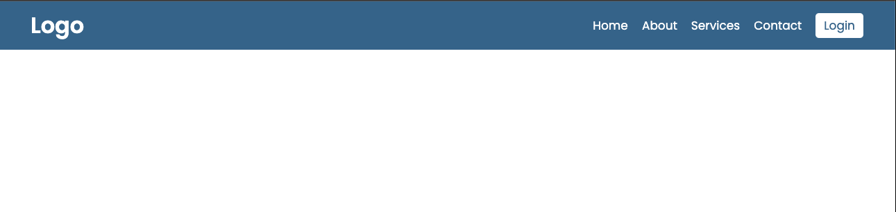

# Clean Horizontal Navigation Bar

## Overview

A clean, professional horizontal navigation bar built with HTML and CSS. This project demonstrates modern web design principles with a minimalist approach, featuring a centered container layout, hover effects, and professional typography. The navigation showcases a classic desktop-first design pattern with a prominent call-to-action button and consistent spacing.

## Preview



## Purpose

This project demonstrates proficiency in:
- **Clean CSS Design** with modern layout techniques
- **Flexbox Layout** for navigation alignment and distribution
- **Professional Typography** using Google Fonts
- **Hover Effects** and interactive state management
- **Container-Based Layouts** with max-width constraints

## Technical Implementation

### Key Features

- **Horizontal Layout**: Classic desktop navigation with inline menu items
- **Centered Container**: Max-width container for optimal content presentation
- **Call-to-Action Button**: Prominent login button with hover effects
- **Clean Typography**: Google Fonts integration with consistent sizing
- **Color Scheme**: Professional blue theme with white accents
- **Responsive Container**: Flexible layout within maximum width constraints
- **Hover Interactions**: Smooth transitions for enhanced user experience

### HTML Structure

```html
<!-- Clean semantic navigation -->
<div class="navbar">
  <div class="container">
    <div class="logo">
      <h1>Logo</h1>
    </div>
    <nav>
      <ul>
        <li><a href="#">Home</a></li>
        <li><a href="#">About</a></li>
        <li><a href="#">Services</a></li>
        <li><a href="#">Contact</a></li>
      </ul>
      <div class="button">
        <a href="">Login</a>
      </div>
    </nav>
  </div>
</div>
```

### CSS Highlights

```css
/* Container-based layout */
.navbar .container {
  max-width: 1200px;
  margin: 0px auto;
  display: flex;
  justify-content: space-between;
  align-items: center;
  height: 70px;
}

/* Professional navigation styling */
nav {
  display: flex;
}

nav ul {
  display: flex;
  margin-right: 10px;
}

/* Call-to-action button */
.navbar .button a {
  background-color: #fff;
  color: #456d96;
  padding: 6px 12px;
  border-radius: 5px;
  transition: 0.2s ease;
}

.navbar .button a:hover {
  background-color: #ddd;
}
```

## Project Structure

```
nav-bar2/
├── index.html          # Main HTML navigation structure
├── css/
│   └── style.css       # Complete CSS styling
├── assets/
│   └── images/
│       └── img-1.png   # Navigation screenshot
├── js/                # JavaScript files (empty - pure CSS solution)
└── img/               # Additional images (if any)
```

## Design Patterns

### Layout Architecture
- **Container Pattern** - Centered max-width layout for content control
- **Flexbox Distribution** - Space-between for logo and navigation alignment
- **Inline Navigation** - Horizontal menu with consistent spacing
- **Button Styling** - Distinct call-to-action with visual prominence

### CSS Techniques
- **Google Fonts** - Professional typography with Poppins font family
- **CSS Reset** - Consistent styling across browsers with universal reset
- **Flexbox Alignment** - Modern alignment and distribution techniques
- **Hover States** - Interactive feedback with smooth transitions
- **Color Psychology** - Professional blue scheme for trust and reliability

### User Experience Design
1. **Visual Hierarchy** - Clear distinction between logo, navigation, and CTA
2. **Consistent Spacing** - Uniform margins and padding throughout
3. **Interactive Feedback** - Hover effects for user guidance
4. **Professional Appearance** - Clean, business-appropriate design

## Browser Compatibility

- Chrome 57+
- Firefox 52+
- Safari 10.1+
- Edge 16+
- IE 11+ (with Flexbox support)

## Performance Considerations

- **Pure CSS Solution** - No JavaScript dependencies for core functionality
- **Optimized Typography** - Google Fonts with display=swap optimization
- **Minimal DOM** - Clean HTML structure for fast rendering
- **Efficient CSS** - Well-organized stylesheets with minimal redundancy
- **Lightweight Design** - Fast loading with minimal external resources

## Navigation Components

| Component | Styling | Functionality |
|-----------|---------|---------------|
| Logo | Bold typography, left alignment | Brand identification |
| Navigation Links | Inline flex layout, consistent spacing | Site navigation |
| Login Button | Contrasting CTA styling, hover effects | User authentication entry |
| Container | Max-width centered layout | Content organization |

## Learning Outcomes

This project demonstrates understanding of:
- Modern CSS layout techniques with Flexbox
- Professional web design principles and typography
- Container-based responsive design patterns
- Interactive state management with CSS
- Clean code organization and maintainability

## Setup & Usage

1. Clone the repository
2. Open `index.html` in a web browser
3. Observe the clean horizontal navigation layout
4. Test hover effects on navigation links and login button
5. Resize browser to see container behavior

---

**Tech Stack**: HTML5, CSS3, Google Fonts  
**Layout**: Flexbox, Container-Based Design  
**Methodology**: Clean Architecture, Professional UI Design
