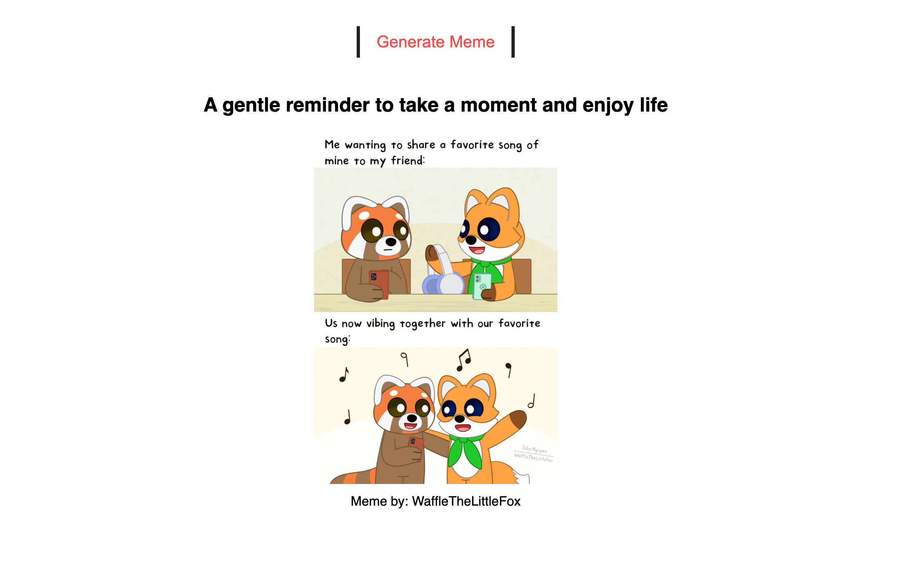
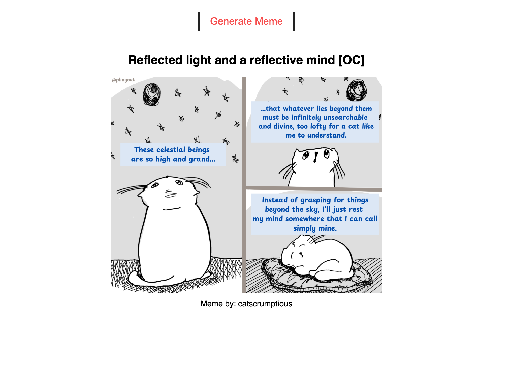

# Random Meme Generator

## Overview

A fun, interactive web app that fetches and displays random memes using the Meme API. Built with HTML, CSS, and JavaScript, this project demonstrates API integration, dynamic DOM updates, and a clean, responsive UI.

## Preview

| Meme Example 1 | Meme Example 2 |
|----------------|----------------|
|  |  |

## Purpose

This project demonstrates proficiency in:
- **API Integration**: Fetching data from a public meme API
- **Dynamic JavaScript**: Real-time content updates and event handling
- **Responsive Design**: Clean, mobile-friendly layout
- **User Experience**: Simple, engaging, and interactive interface

## Technical Implementation

### Key Features

- **Random Meme Fetching**: Get a new meme with each button click
- **API Usage**: Integrates with https://meme-api.com/gimme/wholesomememes
- **Dynamic DOM Updates**: Updates image, title, and author in real time
- **Responsive Layout**: Works on desktop and mobile

### HTML Structure

```html
<div class="meme-generator">
	<button class="generate-meme-btn">Generate Meme</button>
	<h2 class="meme-title">Loading...</h2>
	
	<div class="meme-author"></div>
</div>
```

### CSS Highlights

```css
.meme-generator img {
	height: 430px;
	object-fit: cover;
}
.meme-generator .generate-meme-btn {
	padding: 8px 20px;
	font-size: 20px;
	color: #f64d4d;
	background: #fff;
	border: none;
	cursor: pointer;
	transition: all 400ms ease;
}
```

### JavaScript Highlights

- Fetches memes from the Meme API
- Updates the meme image, title, and author dynamically
- Handles button click events for new memes

## Project Structure

```
random-meme-generator/
├── index.html
├── style.css
├── main.js
├── images/
│   ├── img-1.png
│   └── img-2.png
└── README.md
```

## Design Patterns

- **Component-Based UI**: Each meme is a self-contained component
- **Separation of Concerns**: HTML for structure, CSS for style, JS for behavior

## Browser Compatibility

- Chrome 60+
- Firefox 55+
- Safari 12+
- Edge 79+

## Learning Outcomes

This project demonstrates understanding of:
- Fetch API and asynchronous JavaScript
- Responsive and accessible web design
- Clean code organization and documentation

## Setup & Usage

1. Clone the repository
2. Open `index.html` in your web browser
3. Click "Generate Meme" to fetch and view random memes

---

**Tech Stack**: HTML5, CSS3, JavaScript  
**Methodology**: API Integration, Responsive Design, User-Centered UI

---
