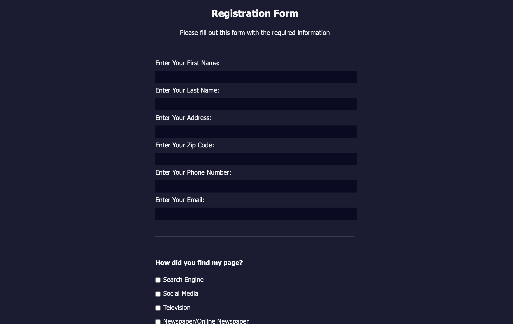
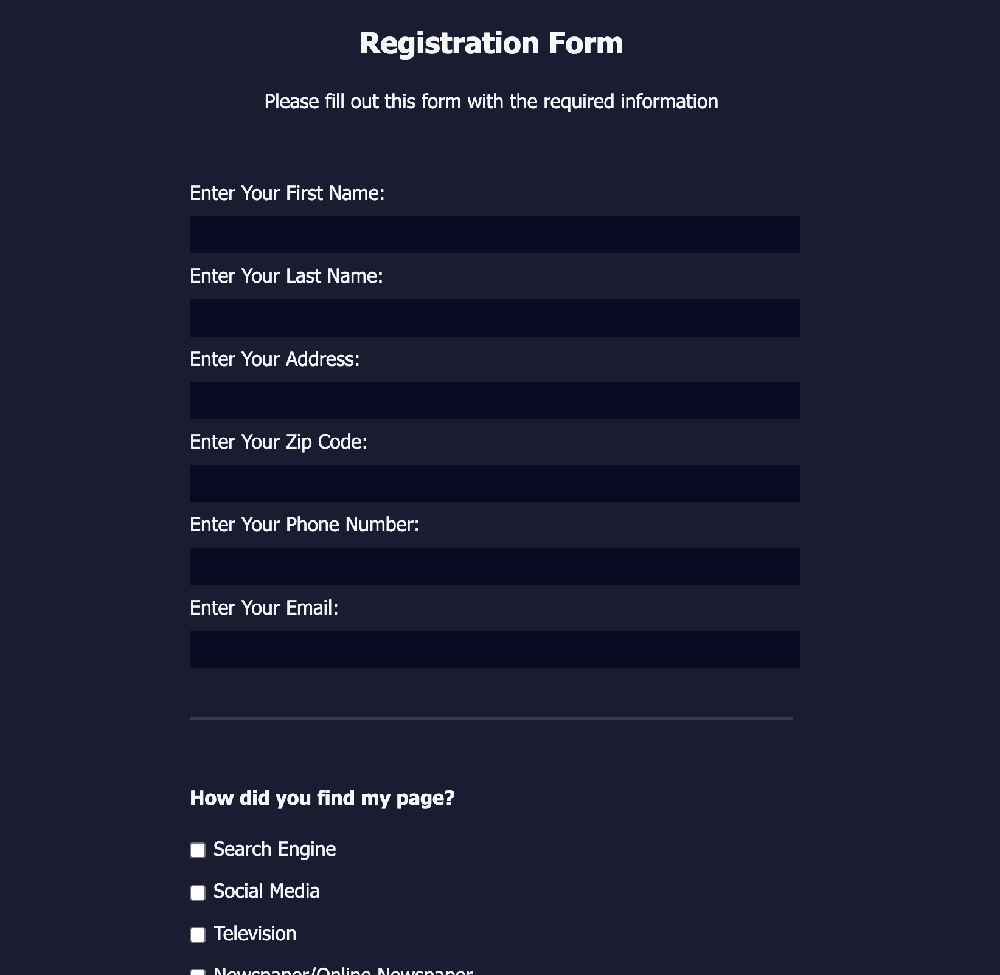
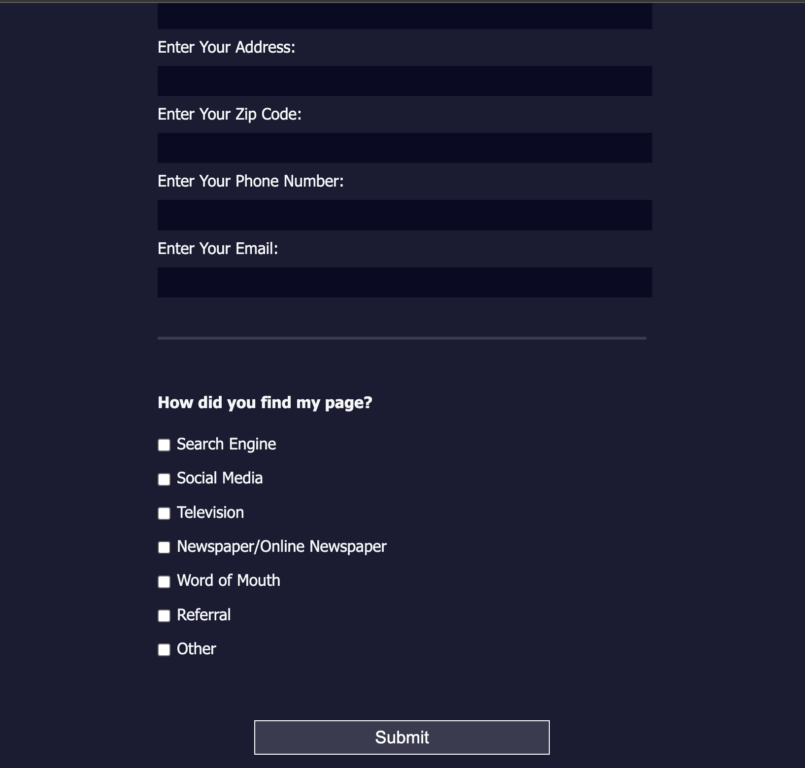
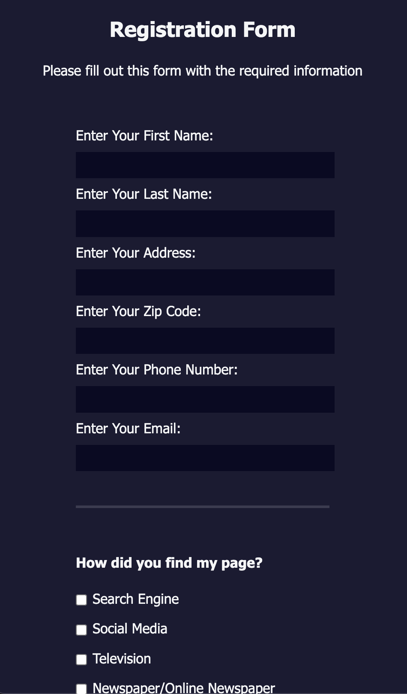

# Registration Form

A professional, responsive registration form built with HTML and CSS. This project demonstrates a clean and accessible form layout for collecting user information, with a focus on usability and modern design.

## Features

- **Responsive Design**: Adapts to all screen sizes for optimal usability.
- **Comprehensive Fields**: Collects first name, last name, address, zip code, phone number, email, and how the user found the page.
- **Accessible Markup**: Semantic HTML and clear labels for accessibility.
- **Modern UI**: Clean layout with clear sections and easy-to-read inputs.
- **Custom Styling**: Uses CSS for a dark, modern look and intuitive form controls.

## Preview

Below are screenshots of the project:

## Usage

1. Clone the repository or copy the `registration-form` folder.
2. Open `index.html` in your browser to view and use the form.
3. Customize the form fields or styles in `style.css` as needed.

## File Structure

- `index.html` – Main HTML file containing the registration form.
- `style.css` – CSS file for styling the form and layout.
- `images/` – Contains screenshots and assets for the project.

## Technical Overview

This project is a static registration form built with HTML and CSS:

1. **HTML Structure**: The form is organized into two main sections using `<fieldset>`. The first collects personal information (name, address, zip, phone, email). The second collects information on how the user found the page, using checkboxes for multiple options.
2. **CSS Styling**: The form is centered on the page with a dark background, white text, and clear input fields. Responsive design ensures usability on all devices. Inputs and buttons are styled for clarity and accessibility.
3. **Accessibility**: All fields use `<label>` elements for better screen reader support and usability. Required fields enforce user input before submission.

This project demonstrates best practices for building accessible, user-friendly forms with modern HTML and CSS.

## License

This project is open source and available for any use. Attribution is appreciated but not required.
