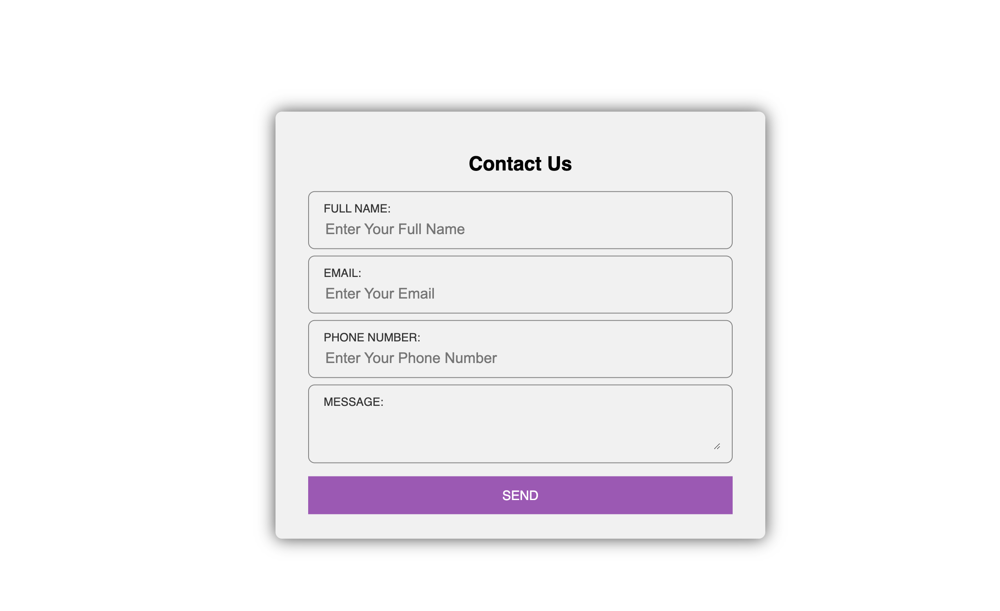
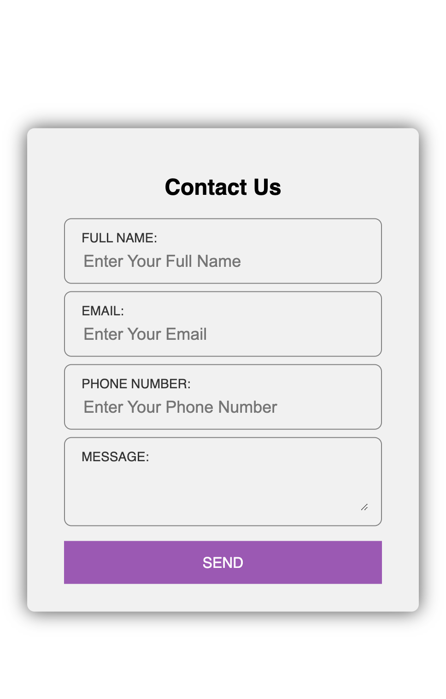

# Responsive Contact Form 2

A clean and modern responsive contact form built with HTML and CSS. This project demonstrates a professional contact form layout with a focus on usability, accessibility, and mobile-first design.

## Features

- **Responsive Design**: Adapts seamlessly to all screen sizes, from mobile to desktop.
- **Modern UI**: Uses a card-style layout with subtle shadows and rounded corners for a professional look.
- **Accessible Markup**: Semantic HTML and clear labels for improved accessibility.
- **Custom Styling**: Styled form fields and button for a cohesive user experience.

## Preview

Below are screenshots of the project:

## Usage

1. Clone the repository or copy the `responsive-contact-2` folder.
2. Open `index.html` in your browser to view the contact form.
3. Customize the form fields or styles in `style.css` as needed.

## File Structure

- `index.html` – Main HTML file containing the contact form structure.
- `style.css` – CSS file for styling the form and layout.
- `images/` – Contains screenshots and assets for the project.

## License

This project is open source and available for any use. Attribution is appreciated but not required.
