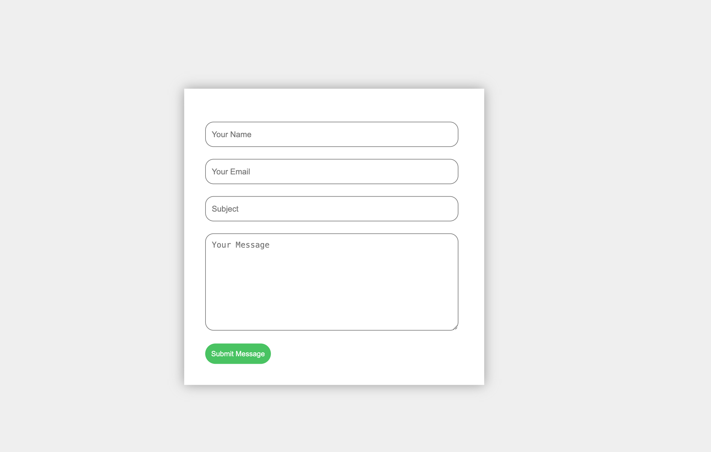

# Responsive Contact Page

## Overview

A clean, responsive contact form page built with HTML and CSS. This project demonstrates modern form design, accessibility, and a visually appealing layout suitable for any website’s contact section.

## Preview



## Purpose

This project demonstrates proficiency in:
- **Responsive CSS**: Form adapts to different screen sizes
- **UI/UX**: Clean, user-friendly, and visually appealing form design
- **Accessibility**: Semantic HTML and clear input fields

## Technical Implementation

### Key Features

- **Contact Form**: Name, email, subject, and message fields
- **Responsive Layout**: Centered form with adaptive sizing
- **Modern Styling**: Rounded corners, box shadows, and color accents
- **Accessible Inputs**: Clear placeholders and logical tab order

### HTML Structure

```html
<form>
	<input type="text" class="input-field" placeholder="Your Name">
	<input type="email" class="input-field" placeholder="Your Email">
	<input type="text" class="input-field" placeholder="Subject">
	<textarea class="input-field textarea-field" placeholder="Your Message"></textarea>
	<button type="button" class="btn">Submit Message</button>
</form>
```

### CSS Highlights

```css
.contact-box {
	width: 500px;
	background-color: #fff;
	box-shadow: 0 0 20px #999;
	position: absolute;
	top: 50%; left: 50%;
	transform: translate(-50%, -50%);
}
.input-field {
	width: 400px;
	height: 40px;
	margin-top: 20px;
	border-radius: 14px;
	border: 1px solid #777;
}
.btn {
	border-radius: 20px;
	color: #fff;
	background-color: #47c35a;
	padding: 10px;
	cursor: pointer;
}
```

## Project Structure

```
responsive-contact-page/
├── index.html
├── style.css
├── image/
│   └── img-1.png
└── README.md
```

## Design Patterns

- **Centered Form**: Visually focused and easy to use
- **Separation of Concerns**: HTML for structure, CSS for style

## Browser Compatibility

- Chrome 60+
- Firefox 55+
- Safari 12+
- Edge 79+

## Learning Outcomes

This project demonstrates understanding of:
- Responsive and accessible form design
- Modern CSS layout and styling
- Clean code organization and documentation

## Setup & Usage

1. Clone the repository
2. Open `index.html` in your web browser
3. Fill out and interact with the contact form

---

**Tech Stack**: HTML5, CSS3  
**Methodology**: Responsive Design, User-Centered UI

---
