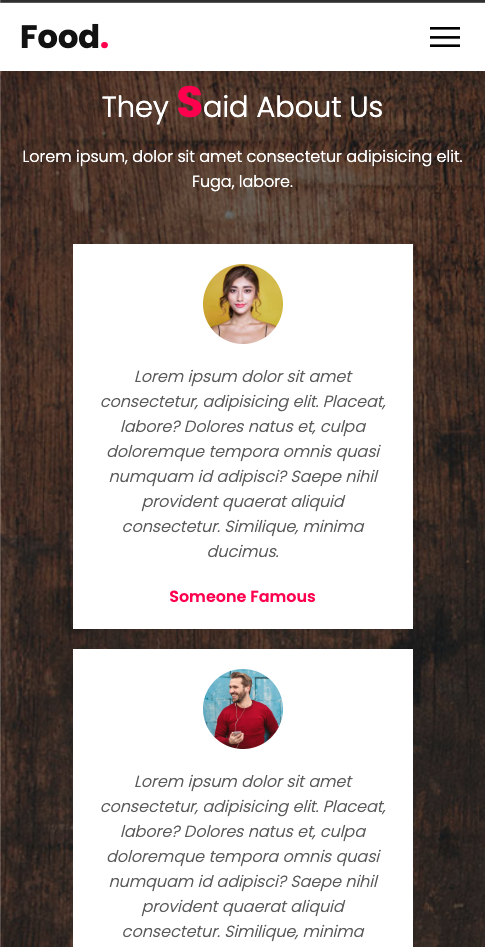

# Responsive Food Restaurant Website

## Overview

A modern, fully responsive restaurant website built with HTML, CSS, and JavaScript. This project demonstrates professional web design with multiple sections, mobile-first responsive design, smooth scrolling navigation, and interactive elements. The site features a complete restaurant experience with hero banner, about section, menu showcase, expert team, customer testimonials, and contact form.

## Preview

### Main Section


### Mobile Navigation


### About Section


### Menu Section


### Kitchen Expert Section


### Review Section




### Contact Section


## Purpose

This project demonstrates proficiency in:
- **Full-Stack Web Design** with complete restaurant website functionality
- **Responsive Design** with mobile-first approach and breakpoint management
- **Modern CSS Techniques** including Flexbox, CSS Grid, and animations
- **JavaScript Interactivity** with smooth scrolling and mobile menu toggle
- **Professional UI/UX** design patterns for hospitality industry

## Technical Implementation

### Key Features

- **Responsive Navigation**: Sticky header with mobile hamburger menu
- **Hero Banner**: Full-screen background with call-to-action
- **About Section**: Two-column layout with company information
- **Menu Showcase**: Grid-based food item display with images
- **Expert Team**: Professional chef profiles with images
- **Customer Testimonials**: Review cards with customer photos
- **Contact Form**: Professional contact form with validation-ready inputs
- **Smooth Scrolling**: Anchor-based navigation between sections
- **Mobile Optimization**: Complete mobile responsiveness with touch-friendly UI

### HTML Structure

```html
<!-- Modern semantic structure -->
<header>
  <a href="#" class="logo">Food<span>.</span></a>
  <div class="menuToggle" onclick="toggleMenu();"></div>
  <ul class="navigation">
    <li><a href="#banner">Home</a></li>
    <li><a href="#about">About</a></li>
    <li><a href="#menu">Menu</a></li>
    <li><a href="#expert">Expert</a></li>
    <li><a href="#testimonials">Testimonials</a></li>
    <li><a href="#contact">Contact</a></li>
  </ul>
</header>

<section class="banner" id="banner">
  <div class="content">
    <h2>Always Choose Good</h2>
    <p>Restaurant description...</p>
    <a href="#" class="btn">Our Menu</a>
  </div>
</section>
```

### CSS Highlights

```css
/* Responsive navigation */
header {
  position: fixed;
  top: 0;
  left: 0;
  width: 100%;
  padding: 40px 100px;
  z-index: 10000;
  transition: 0.5s;
}

header.sticky {
  background: #fff;
  padding: 10px 100px;
  box-shadow: 0 5px 20px rgba(0,0,0,0.05);
}

/* Hero banner with background */
.banner {
  position: relative;
  width: 100%;
  min-height: 100vh;
  display: flex;
  justify-content: center;
  align-items: center;
  background: url(images/bg.jpg);
  background-size: cover;
}

/* Responsive grid layouts */
.menu .content {
  display: flex;
  justify-content: center;
  flex-direction: row-reverse;
  flex-wrap: wrap;
  margin-top: 40px;
}

/* Mobile responsiveness */
@media (max-width: 991px) {
  header .navigation.active {
    width: 100%;
    height: calc(100% - 68px);
    position: fixed;
    top: 68px;
    left: 0;
    display: flex;
    justify-content: center;
    align-items: center;
    flex-direction: column;
    background: #fff;
  }
}
```

### JavaScript Functionality

```javascript
// Sticky navigation on scroll
window.addEventListener('scroll', function(){
  const header = document.querySelector('header');
  header.classList.toggle("sticky", window.scrollY > 0);
});

// Mobile menu toggle
function toggleMenu(){
  const menuToggle = document.querySelector('.menuToggle');
  const navigation = document.querySelector('.navigation');
  menuToggle.classList.toggle('active');
  navigation.classList.toggle('active');
}
```

## Project Structure

```
responsive-food-site/
├── index.html          # Main HTML structure with all sections
├── style.css           # Complete CSS styling and responsive design
├── assets/
│   └── images/
│       ├── img-1.png           # Main site desktop
│       ├── img-1-mobile.png    # Main site mobile
│       ├── img-1-nav.png       # Mobile navigation
│       ├── img-2.png           # About section desktop
│       ├── img-2-mobile.png    # About section mobile
│       ├── img-3.png           # Menu section desktop
│       ├── img-3-mobile.png    # Menu section mobile
│       ├── img-4.png           # Expert section desktop
│       ├── img-4-mobile.png    # Expert section mobile
│       ├── img-5.png           # Review section desktop
│       ├── img-5-mobile.png    # Review section mobile
│       ├── img-6.png           # Contact section desktop
│       └── img-6-mobile.png    # Contact section mobile
└── images/                     # Food and background images
```

## Design Patterns

### Responsive Design Strategy
- **Mobile-First Approach** - Base styles target mobile devices
- **Breakpoint Management** - 991px and 480px breakpoints for optimal viewing
- **Flexible Layouts** - Flexbox and CSS Grid for adaptive content
- **Touch Optimization** - Mobile-friendly navigation and interactions

### CSS Architecture
- **Google Fonts Integration** - Poppins font family for modern typography
- **CSS Custom Properties** - Consistent color scheme (#ff0157 primary)
- **Section-Based Styling** - Modular CSS for different page sections
- **Background Images** - Multiple hero sections with background imagery

### JavaScript Patterns
- **Event-Driven Programming** - Scroll and click event handling
- **DOM Manipulation** - Class toggling for state management
- **Smooth Scrolling** - CSS scroll-behavior for navigation
- **Progressive Enhancement** - Core functionality works without JavaScript

## Browser Compatibility

- Chrome 60+
- Firefox 55+
- Safari 12+
- Edge 79+
- IE 11+ (with CSS Grid and Flexbox support)

## Performance Considerations

- **Optimized Images** - Background images and food photography
- **Efficient CSS** - Well-organized stylesheets with minimal redundancy
- **Minimal JavaScript** - Lightweight interactivity for core functionality
- **Google Fonts** - Optimized font loading with display=swap
- **Mobile Performance** - Touch-optimized interactions and smooth scrolling

## Website Sections

| Section | Desktop Features | Mobile Features |
|---------|------------------|-----------------|
| Header | Sticky navigation with smooth transitions | Hamburger menu with full-screen overlay |
| Banner | Full-screen hero with background image | Responsive typography and button scaling |
| About | Two-column layout with image and text | Stacked single-column layout |
| Menu | Grid layout with food item cards | Responsive grid with smaller cards |
| Expert | Team member profiles in grid | Mobile-optimized expert cards |
| Testimonials | Customer review cards with photos | Stacked testimonial layout |
| Contact | Professional contact form | Mobile-friendly form inputs |

## Learning Outcomes

This project demonstrates understanding of:
- Complete responsive website development from mobile to desktop
- Modern CSS layout techniques including Flexbox and CSS Grid
- JavaScript interactivity for navigation and user experience
- Professional web design patterns for hospitality industry
- Performance optimization and cross-browser compatibility

## Setup & Usage

1. Clone the repository
2. Open `index.html` in a web browser
3. Navigate through sections using the sticky navigation
4. Test mobile functionality by resizing browser or using device tools
5. Experience smooth scrolling and interactive elements

---

**Tech Stack**: HTML5, CSS3, Vanilla JavaScript, Google Fonts  
**Responsive**: Mobile-First Design, CSS Media Queries, Flexbox, CSS Grid  
**Methodology**: Progressive Enhancement, Performance Optimization, Modern Web Standards
