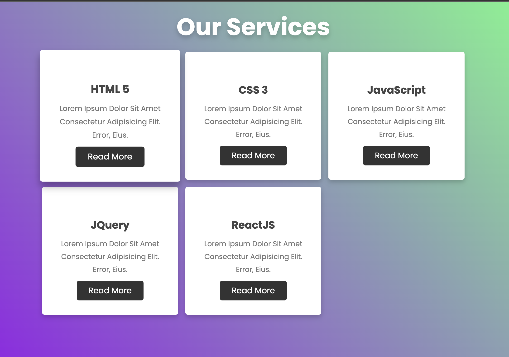
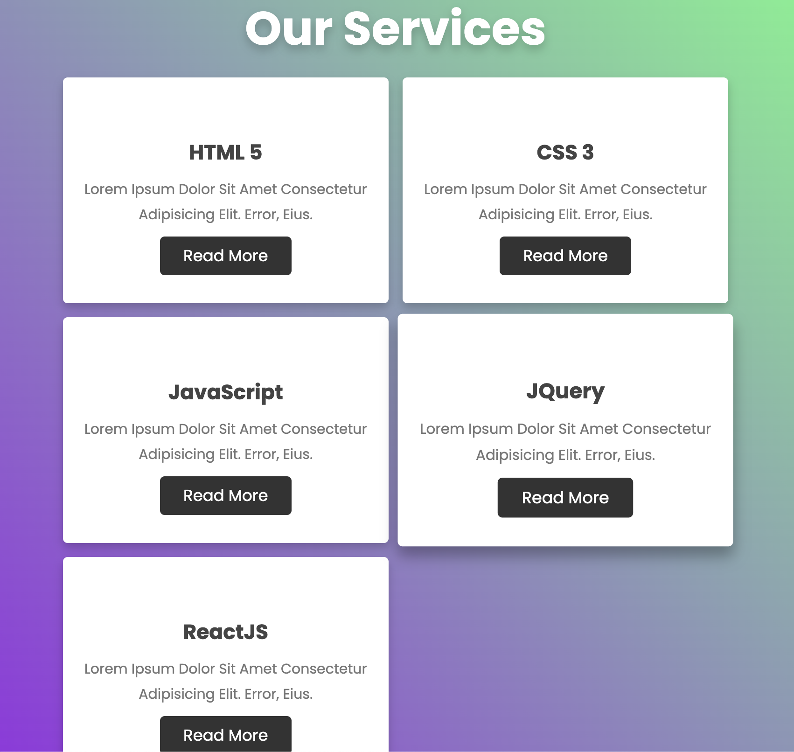
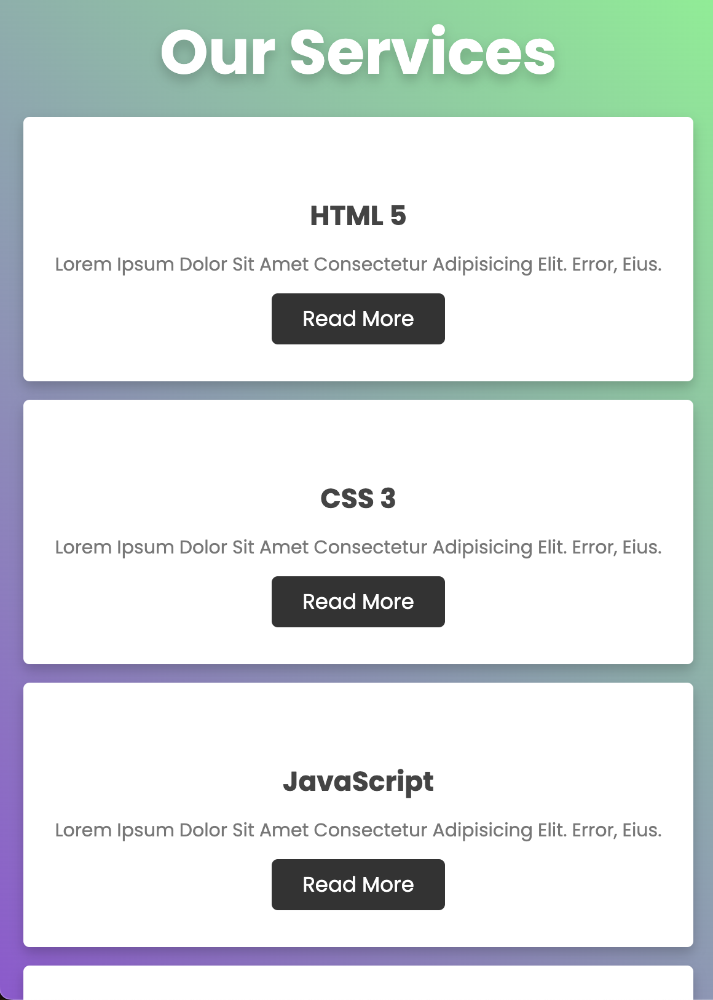

# Responsive Service Box

A modern, responsive service box section built with HTML and CSS. This project demonstrates a professional layout for showcasing services or features, with a focus on clean design, usability, and mobile-first responsiveness.

## Features

- **Responsive Design**: Adapts seamlessly to all screen sizes, from mobile to desktop.
- **Modern UI**: Card-style service boxes with gradients, shadows, and smooth hover effects.
- **Custom Styling**: Utilizes CSS Grid for layout and Google Fonts for typography.
- **Accessible Markup**: Semantic HTML for improved accessibility.

## Preview

Below are screenshots of the project:

## Usage

1. Clone the repository or copy the `responsive-service-box` folder.
2. Open `index.html` in your browser to view the service boxes.
3. Customize the content or styles in `style.css` as needed.

## File Structure

- `index.html` – Main HTML file containing the service box section.
- `style.css` – CSS file for styling the layout and boxes.
- `images/` – Contains screenshots and assets for the project.

## License

This project is open source and available for any use. Attribution is appreciated but not required.
