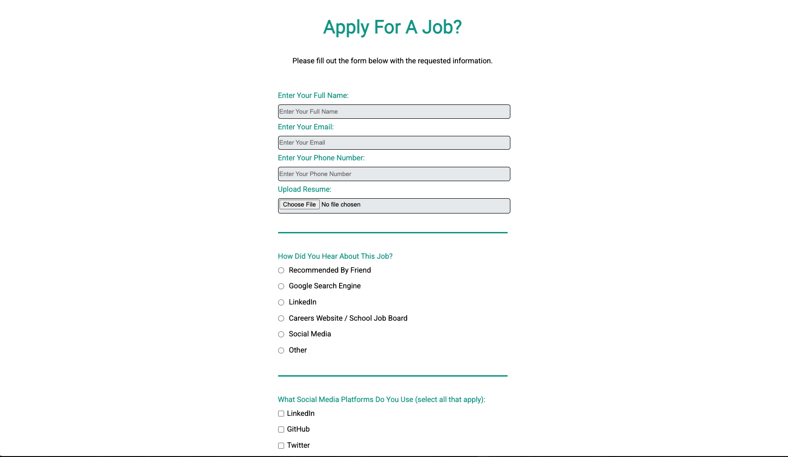

# Responsive Survey Form

## Overview

A professional job application survey form built with semantic HTML and modern CSS styling. This project demonstrates advanced form design principles, accessibility best practices, and responsive layout techniques. The form includes comprehensive validation, multiple input types, and a clean, user-friendly interface suitable for real-world applications.

## Preview



## Purpose

This project demonstrates proficiency in:
- **Semantic HTML Forms** with proper labeling and accessibility
- **Form Validation** using HTML5 input types and attributes
- **Responsive Design** with flexible layouts and mobile-first approach
- **CSS Styling** including custom form elements and hover effects
- **User Experience** design with intuitive form flow and visual hierarchy

## Technical Implementation

### Key Features

- **Comprehensive Form Elements**: Text inputs, email, phone, file upload, radio buttons, checkboxes, dropdown, and textarea
- **HTML5 Validation**: Built-in form validation with required fields and input type constraints
- **Responsive Layout**: Flexible design that adapts from mobile to desktop
- **Custom Styling**: Professional appearance with consistent color scheme and typography
- **Accessibility**: Proper label associations and semantic fieldset organization
- **File Upload**: Resume upload functionality for job applications
- **Interactive Elements**: Hover effects and visual feedback

### HTML Structure

```html
<!-- Semantic form with proper fieldset organization -->
<form id="survey-form" action="https://register-demo.freecodecamp.org">
  <fieldset>
    <label id="name-label">Enter Your Full Name: 
      <input type="text" id="name" required placeholder="Enter Your Full Name" />
    </label>
    <label id="email-label">Enter Your Email: 
      <input type="email" id="email" required placeholder="Enter Your Email" />
    </label>
  </fieldset>
</form>
```

### CSS Highlights

```css
/* Responsive form container */
form {
  width: 60vw;
  max-width: 500px;
  min-width: 300px;
  margin: 0 auto;
}

/* Custom input styling */
input, textarea, select {
  margin: 10px 0 0 0;
  width: 100%;
  min-height: 2em;
  border-radius: 5px;
  background-color: #e9ecef;
  border: 1px solid black;
}

/* Interactive submit button */
input[type="submit"]:hover {
  opacity: 0.5;
}
```

## Project Structure

```
survey-form/
├── index.html          # Main HTML form structure
├── style.css           # CSS styling and responsive design
└── assets/
    └── images/
        └── img-1.png   # Form screenshot
```

## Design Patterns

### HTML Form Best Practices
- **Fieldset Organization** - Logical grouping of related form elements
- **Label Association** - Proper for/id relationships for accessibility
- **Input Types** - HTML5 semantic input types (email, tel, number, file)
- **Validation Attributes** - Required fields and input constraints
- **Placeholder Text** - Helpful user guidance

### CSS Architecture
- **Mobile-First Design** - Responsive layout with min/max width constraints
- **Custom Properties** - Consistent color scheme with CSS variables
- **Flexbox Layout** - Modern alignment and spacing techniques
- **Typography** - Google Fonts integration for professional appearance
- **Interactive States** - Hover effects and visual feedback

### Accessibility Features
1. **Semantic Markup** - Proper use of form elements and labels
2. **Keyboard Navigation** - Tab order and focus management
3. **Screen Reader Support** - Descriptive labels and fieldset legends
4. **Color Contrast** - Accessible color combinations

## Browser Compatibility

- Chrome 60+
- Firefox 55+
- Safari 12+
- Edge 79+
- IE 11+ (with graceful degradation)

## Performance Considerations

- **Lightweight CSS** - Minimal external dependencies (Google Fonts only)
- **Semantic HTML** - Clean, efficient markup structure
- **Optimized Images** - Compressed screenshots for documentation
- **Fast Loading** - No JavaScript dependencies for core functionality
- **Progressive Enhancement** - Works without CSS/JS enabled

## Form Validation Features

| Field Type | Validation | User Feedback |
|------------|------------|---------------|
| Name | Required text input | Placeholder guidance |
| Email | HTML5 email validation | Built-in browser validation |
| Phone | Required phone input | Format guidance |
| File Upload | Resume upload | File selection interface |
| Radio Buttons | Job discovery source | Single selection |
| Checkboxes | Social media platforms | Multiple selections |
| Dropdown | Position selection | Structured options |
| Textarea | Personal description | Multi-line text input |

## Learning Outcomes

This project demonstrates understanding of:
- Advanced HTML form construction and validation
- CSS layout techniques and responsive design principles
- Accessibility standards and inclusive design practices
- User experience optimization for form completion
- Professional styling and visual design consistency

## Setup & Usage

1. Clone the repository
2. Open `index.html` in a web browser
3. Fill out the form fields to test validation
4. Submit the form to see the action endpoint
5. Resize browser window to test responsive behavior

---

**Tech Stack**: HTML5, CSS3, Google Fonts  
**Validation**: HTML5 Form Validation  
**Methodology**: Mobile-First, Progressive Enhancement, Accessibility-First
