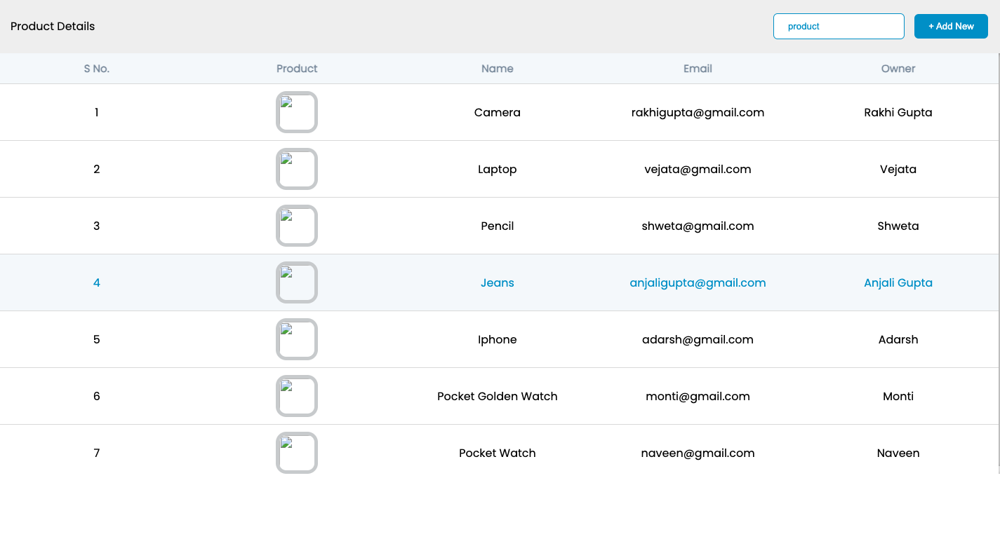

# Professional Data Table

## Overview

A modern, responsive data table component built with HTML and CSS. This project demonstrates advanced table design patterns with product management functionality, including sticky headers, hover effects, image integration, and professional styling. The table features a clean interface suitable for admin dashboards, product catalogs, and data management systems.

## Preview



## Purpose

This project demonstrates proficiency in:
- **Advanced Table Design** with modern styling and functionality
- **Data Presentation** with structured product information display
- **Sticky Header Implementation** for improved user experience
- **Image Integration** within table cells with proper styling
- **Professional UI Components** suitable for business applications

## Technical Implementation

### Key Features

- **Product Management Interface**: Complete table for product details with images
- **Sticky Table Header**: Header remains visible during scrolling
- **Interactive Rows**: Hover effects with color transitions
- **Image Display**: Product images with rounded borders and proper sizing
- **Search Functionality**: Input field for product filtering (frontend ready)
- **Add New Button**: Call-to-action for adding new products
- **Custom Scrollbars**: Styled scrollbars for improved aesthetics
- **Responsive Design**: Fixed table layout with horizontal scrolling

### HTML Structure

```html
<!-- Professional table structure -->
<div class="table">
  <div class="table_header">
    <p>Product Details</p>
    <div>
      <input placeholder="product" />
      <button class="add_new">+ Add New</button>
    </div>
  </div>
  
  <div class="table_section">
    <table>
      <thead>
        <tr>
          <th>S No.</th>
          <th>Product</th>
          <th>Name</th>
          <th>Email</th>
          <th>Owner</th>
        </tr>
      </thead>
      <tbody>
        <tr>
          <td>1</td>
          <td></td>
          <td>Camera</td>
          <td>owner@email.com</td>
          <td>Owner Name</td>
        </tr>
      </tbody>
    </table>
  </div>
</div>
```

### CSS Highlights

```css
/* Sticky header implementation */
thead th {
  position: sticky;
  top: 0;
  background-color: #f6f9fc;
  color: #8493a5;
}

/* Table scrolling container */
.table_section {
  height: 600px;
  overflow: auto;
}

/* Image styling within table */
td img {
  height: 60px;
  width: 60px;
  object-fit: cover;
  border-radius: 15px;
  border: 5px solid #ced0d2;
}

/* Interactive row effects */
tr:hover td {
  color: #0298cf;
  cursor: pointer;
  background-color: #f6f9fc;
}

/* Custom scrollbar styling */
::-webkit-scrollbar {
  height: 5px;
  width: 5px;
}
```

## Project Structure

```
table-css-1/
├── index.html          # Main HTML table structure
├── style.css           # Complete CSS styling and interactions
└── images/
    └── img-1.png       # Table component screenshot
```

## Design Patterns

### Table Architecture
- **Semantic HTML Tables** - Proper thead, tbody structure for accessibility
- **Fixed Table Layout** - Consistent column widths with table-layout: fixed
- **Sticky Positioning** - Header remains visible during content scrolling
- **Overflow Management** - Controlled scrolling with custom scrollbars

### CSS Techniques
- **Google Fonts Integration** - Poppins font for modern typography
- **Flexbox Layout** - Header section with space-between alignment
- **Object-fit Properties** - Proper image scaling within table cells
- **Hover State Management** - Interactive feedback for table rows
- **Custom Scrollbar Styling** - WebKit scrollbar customization

### User Experience Design
1. **Visual Hierarchy** - Clear header, content, and action areas
2. **Interactive Feedback** - Hover effects and visual state changes
3. **Data Organization** - Logical column structure for product information
4. **Action Integration** - Search and add functionality placement

## Browser Compatibility

- Chrome 60+
- Firefox 55+
- Safari 12+
- Edge 79+
- IE 11+ (with sticky positioning support)

## Performance Considerations

- **Efficient Scrolling** - Fixed height container with overflow management
- **Image Optimization** - Object-fit for consistent image presentation
- **Minimal DOM** - Clean table structure for fast rendering
- **CSS Organization** - Well-structured stylesheets for maintainability
- **External Resources** - Google Fonts and Font Awesome via CDN

## Table Features

| Component | Functionality | Styling |
|-----------|---------------|---------|
| Header Section | Title and action controls | Flexbox layout with background |
| Search Input | Product filtering interface | Styled input with blue theme |
| Add Button | New product creation | Primary action button styling |
| Table Header | Column labels with sticky positioning | Fixed header with light background |
| Product Images | Visual product representation | Rounded, bordered thumbnail images |
| Data Rows | Product information display | Hover effects and clean typography |

## Learning Outcomes

This project demonstrates understanding of:
- Advanced CSS table styling and modern layout techniques
- Sticky positioning for improved user interface design
- Image integration and object-fit properties for responsive media
- Interactive state management with CSS hover effects
- Professional UI component design for business applications

## Setup & Usage

1. Clone the repository
2. Open `index.html` in a web browser
3. Scroll through the table to see sticky header functionality
4. Hover over table rows to see interactive effects
5. Observe the professional styling and image integration

---

**Tech Stack**: HTML5, CSS3, Google Fonts, Font Awesome  
**Layout**: CSS Tables, Flexbox, Sticky Positioning  
**Methodology**: Professional UI Design, Data Presentation Patterns
