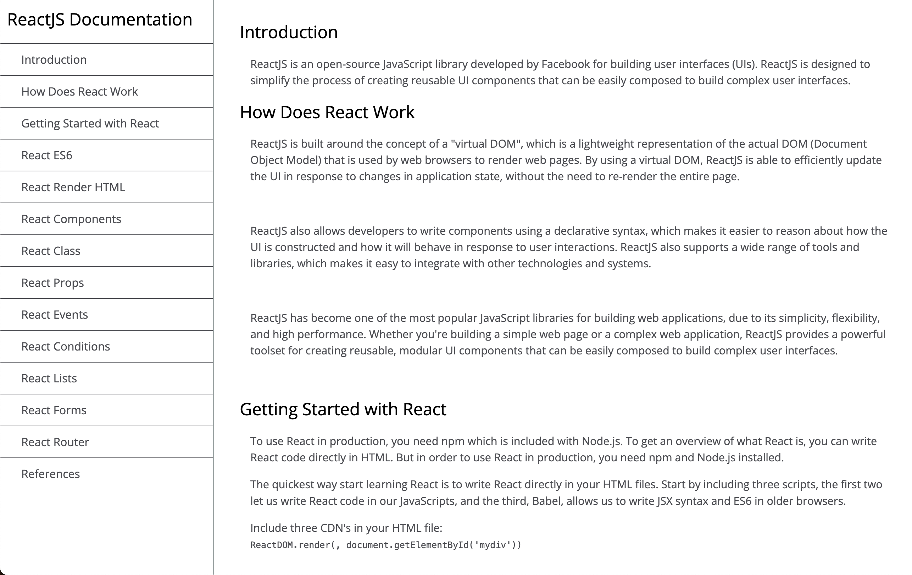

# Technical Documentation Page

## Overview

A responsive, single-page technical documentation site built with HTML and CSS. This project demonstrates a clean, accessible layout for presenting technical guides, featuring a fixed navigation sidebar and smooth scrolling between documentation sections.

## Preview



## Purpose

This project demonstrates proficiency in:
- **Semantic HTML5**: Structured content for documentation and navigation
- **Responsive CSS**: Fixed sidebar, mobile-friendly layout
- **Accessibility**: Keyboard navigation and clear section headings
- **UI/UX**: Clean, readable, and professional documentation design

## Technical Implementation

### Key Features

- **Fixed Navigation Sidebar**: Quick access to all documentation sections
- **Sectioned Content**: Each topic is a clearly defined section with anchor links
- **Responsive Layout**: Adapts to various screen sizes
- **Smooth Scrolling**: Easy navigation between sections

### HTML Structure

```html
<nav id="navbar">
	<header>ReactJS Documentation</header>
	<ul>
		<li><a class="nav-link" href="#Introduction">Introduction</a></li>
		<!-- ...other sections... -->
	</ul>
</nav>
<main id="main-doc">
	<section class="main-section" id="Introduction">
		<header>Introduction</header>
		<article>
			<!-- Section content -->
		</article>
	</section>
	<!-- ...other sections... -->
</main>
```

### CSS Highlights

```css
#navbar {
	position: fixed;
	min-width: 290px;
	width: 300px;
	height: 100%;
	border-right: solid;
	border-color: rgba(0, 22, 22, 0.4);
}
#main-doc {
	margin-left: 310px;
	padding: 20px;
}
body {
	font-family: 'Open Sans', Arial, sans-serif;
	background-color: #fff;
	color: #4d4e53;
}
```

## Project Structure

```
technical-documentation/
├── index.html
├── style.css
├── image/
│   └── img-1.png
└── README.md
```

## Design Patterns

- **Sidebar Navigation**: Persistent, accessible navigation
- **Sectioned Content**: Logical, easy-to-follow documentation flow
- **Separation of Concerns**: HTML for structure, CSS for style

## Browser Compatibility

- Chrome 57+
- Firefox 52+
- Safari 10.1+
- Edge 16+

## Learning Outcomes

This project demonstrates understanding of:
- Semantic HTML for technical writing
- Responsive and accessible web design
- UI/UX for documentation sites

## Setup & Usage

1. Clone the repository
2. Open `index.html` in your web browser
3. Navigate the documentation using the sidebar

---

**Tech Stack**: HTML5, CSS3  
**Methodology**: Semantic HTML, Responsive Design, Accessibility

---
