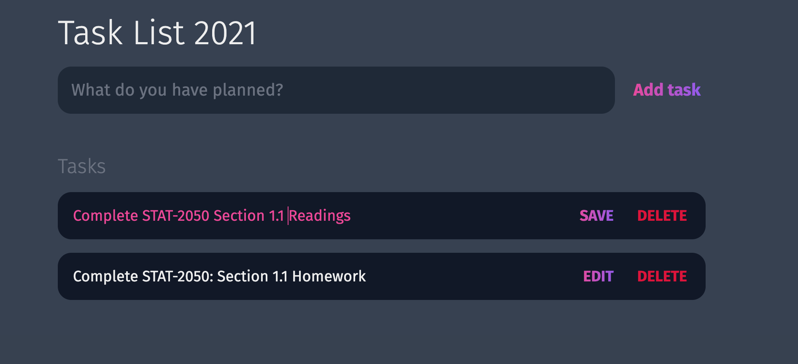

# Interactive To-Do List Application

## Overview

A modern, interactive to-do list application built with HTML, CSS, and JavaScript. This project demonstrates dynamic DOM manipulation, event handling, and local state management. The application features a sleek dark theme design with gradient accents, allowing users to add, edit, delete, and manage their daily tasks with an intuitive user interface.

## Preview

### Initial State


### Added Tasks


### Editing a Task


### Saved Edits


## Purpose

This project demonstrates proficiency in:
- **JavaScript DOM Manipulation** with dynamic element creation and management
- **Event Handling** for form submissions and user interactions
- **Modern CSS Design** with custom properties and gradient effects
- **User Interface Design** with intuitive task management patterns
- **Interactive Web Applications** with real-time feedback and state changes

## Technical Implementation

### Key Features

- **Add New Tasks**: Input field with form submission for adding tasks
- **Edit Tasks**: Click-to-edit functionality with save/edit toggle
- **Delete Tasks**: Remove tasks with single click action
- **Dynamic DOM Creation**: JavaScript-generated task elements
- **Responsive Design**: Flexible layout that adapts to content
- **Modern Styling**: Dark theme with gradient accents and smooth transitions
- **Real-time Feedback**: Immediate visual response to user actions
- **Form Validation**: Prevents empty task submission

### HTML Structure

```html
<!-- Clean semantic structure -->
<header>
  <h1>Task List 2021</h1>
  <form id="new-task-form">
    <input 
      type="text" 
      id="new-task-input" 
      placeholder="What do you have planned?" />
    <input 
      type="submit"
      id="new-task-submit" 
      value="Add task" />
  </form>
</header>

<main>
  <section class="task-list">
    <h2>Tasks</h2>
    <div id="tasks">
      <!-- Dynamic task elements created here -->
    </div>
  </section>
</main>
```

### CSS Highlights

```css
/* CSS Custom Properties for theming */
:root {
  --dark: #374151;
  --darker: #1F2937;
  --darkest: #111827;
  --grey: #6B7280;
  --pink: #EC4899;
  --purple: #8B5CF6;
  --light: #EEE;
}

/* Gradient text effects */
#new-task-submit {
  color: var(--pink);
  background-image: linear-gradient(to right, var(--pink), var(--purple));
  -webkit-background-clip: text;
  -webkit-text-fill-color: transparent;
}

/* Task styling */
#tasks .task {
  display: flex;
  justify-content: space-between;
  background-color: var(--darkest);
  padding: 1rem;
  border-radius: 1rem;
  margin-bottom: 1rem;
}

/* Edit mode styling */
.task .content .text:not(:read-only) {
  color: var(--pink);
}
```

### JavaScript Functionality

```javascript
// Form submission handling
form.addEventListener('submit', (e) => {
  e.preventDefault();
  
  const task = input.value;
  
  // Dynamic element creation
  const task_el = document.createElement('div');
  task_el.classList.add('task');
  
  // Create task content and actions
  // ...
  
  input.value = ''; // Clear input
});

// Edit functionality
task_edit_el.addEventListener('click', (e) => {
  if (task_edit_el.innerText.toLowerCase() == "edit") {
    task_edit_el.innerText = "Save";
    task_input_el.removeAttribute("readonly");
    task_input_el.focus();
  } else {
    task_edit_el.innerText = "Edit";
    task_input_el.setAttribute("readonly", "readonly");
  }
});
```

## Project Structure

```
to-do-list/
├── index.html          # Main HTML structure
├── main.css            # Complete CSS styling with dark theme
├── main.js             # JavaScript functionality and DOM manipulation
└── images/
    ├── img-1.png       # Initial empty state
    ├── img-2.png       # Tasks added state
    ├── img-3.png       # Edit mode state
    └── img-4.png       # Saved changes state
```

## Design Patterns

### JavaScript Architecture
- **Event-Driven Programming** - Form submissions and button clicks
- **Dynamic DOM Manipulation** - Runtime element creation and modification
- **State Management** - Edit/save mode toggling with visual feedback
- **Event Delegation** - Individual task event handling
- **Functional Programming** - Clean separation of concerns

### CSS Design System
- **Custom Properties** - Centralized color and theme management
- **Gradient Effects** - Modern visual styling with webkit properties
- **Flexbox Layout** - Responsive alignment and distribution
- **Dark Theme** - Professional appearance with high contrast
- **Transition Effects** - Smooth interactions and hover states

### User Experience Patterns
1. **Immediate Feedback** - Real-time visual response to actions
2. **Intuitive Controls** - Clear edit/save/delete button functionality
3. **Visual State Changes** - Different styling for edit mode
4. **Form Validation** - Prevents empty task creation

## Browser Compatibility

- Chrome 60+
- Firefox 55+
- Safari 12+
- Edge 79+
- IE 11+ (with CSS Custom Properties support)

## Performance Considerations

- **Efficient DOM Operations** - Direct element manipulation without frameworks
- **Event Optimization** - Proper event listener management
- **CSS Performance** - Hardware-accelerated transitions and transforms
- **Memory Management** - Clean event listener attachment and removal
- **Lightweight Codebase** - No external dependencies

## Application Features

| Feature | Functionality | User Experience |
|---------|---------------|-----------------|
| Add Task | Form submission with input validation | Type and press enter or click add |
| Edit Task | Toggle between read-only and edit modes | Click edit, modify text, click save |
| Delete Task | Remove task from DOM | Click delete button for instant removal |
| Visual Feedback | Color changes and transitions | Immediate response to all actions |
| Form Reset | Clear input after task creation | Ready for next task input |

## Learning Outcomes

This project demonstrates understanding of:
- Advanced JavaScript DOM manipulation and event handling
- Modern CSS design techniques with custom properties and gradients
- Interactive web application development patterns
- User interface design for productivity applications
- State management in vanilla JavaScript applications

## Setup & Usage

1. Clone the repository
2. Open `index.html` in a web browser
3. Add tasks using the input field and "Add task" button
4. Click "Edit" on any task to modify its content
5. Click "Delete" to remove tasks from the list
6. Observe smooth animations and visual feedback

---

**Tech Stack**: HTML5, CSS3, Vanilla JavaScript, Google Fonts  
**Features**: Dynamic DOM Manipulation, Event Handling, CSS Custom Properties  
**Methodology**: Event-Driven Programming, Modern CSS Design, Progressive Enhancement
