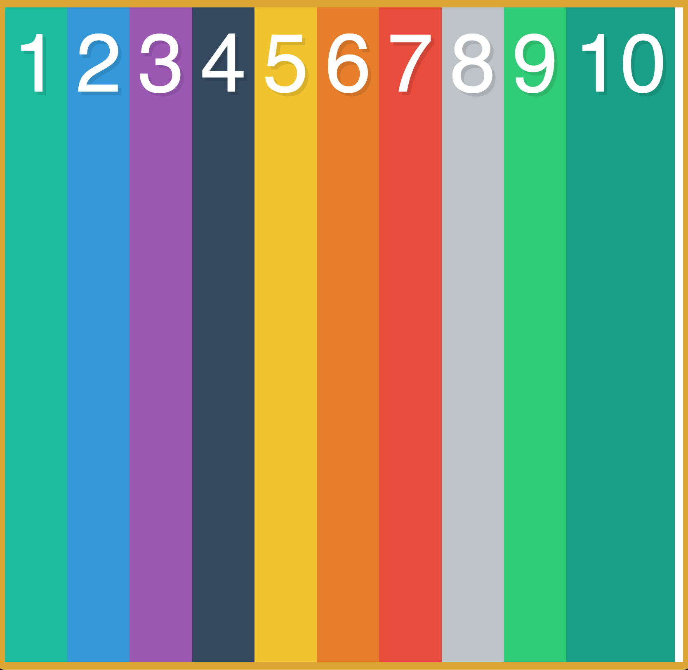

# What The Flexbox

## Overview

A hands-on Flexbox playground and tutorial project built with HTML and CSS. This project visually demonstrates the power and flexibility of CSS Flexbox for modern web layouts, allowing you to experiment with flex properties and see their effects in real time.

## Preview



## Purpose

This project demonstrates proficiency in:
- **CSS Flexbox**: Modern layout techniques for responsive design
- **Visual Learning**: Immediate feedback for flex property changes
- **UI Experimentation**: Tweak, test, and understand Flexbox behavior

## Technical Implementation

### Key Features

- **10 Colorful Boxes**: Each box is uniquely styled for clarity
- **Flex Container**: Uses `display: flex` for layout
- **Responsive Design**: Adapts to viewport size
- **Easy Customization**: Modify the container or boxes to experiment with Flexbox properties

### HTML Structure

```html
<div class="container">
	<div class="box box1">1</div>
	<div class="box box2">2</div>
	...
	<div class="box box10">10</div>
</div>
```

### CSS Highlights

```css
.container {
	display: flex;
	border: 10px solid goldenrod;
	min-height: 100vh;
}
.box {
	color: white;
	font-size: 100px;
	text-align: center;
	padding: 10px;
}
.box1 { background: #1abc9c; }
.box2 { background: #3498db; }
/* ...other box colors... */
```

## Project Structure

```
what-the-flexbox/
├── index.html
├── style.css
├── image/
│   └── img-1.png
└── README.md
```

## Design Patterns

- **Component-Based Layout**: Each box is a visual component
- **Separation of Concerns**: HTML for structure, CSS for layout and style
- **Experimentation-First**: Designed for learning and rapid prototyping

## Browser Compatibility

- Chrome 57+
- Firefox 52+
- Safari 10.1+
- Edge 16+

## Learning Outcomes

This project demonstrates understanding of:
- CSS Flexbox properties and layout patterns
- Responsive and adaptive web design
- Visual debugging and UI experimentation

## Setup & Usage

1. Clone the repository
2. Open `index.html` in your web browser
3. Edit `style.css` to experiment with different Flexbox properties and see the results instantly

---

**Tech Stack**: HTML5, CSS3  
**Methodology**: Flexbox, Responsive Design, Visual Learning

---
